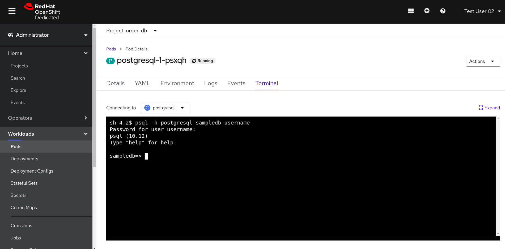

# Workshop Fuse Online API

Demonstração de como criar uma API no Fuse Online para inserir e obter registros de um banco de dados.

> Nehum código é necessário para este workshop.

## Pre-requisitos

### Red Hat Integrately Environment

Para completar esta atividade é necessário instalar e configurar o Fuse Online no Openshift.

### Requisitos de Negócio

Nesta atividade a intenção é simular o desenvolvimento de uma API que irá receber transações dos pedidos efetuados pelos consumidores de uma empresa. 
Após receber estas transações a integração irá gravar na tabela de banco de dados ou irá enviar esta transação para outro sistema através de mensageria.

### Criando um banco de dados no Openshift

Realize o login no Openshift selecionando o identity provider **testing-idp**


Informe seu usuário e senha:


Clique em 'Create Project' e crie um projeto para o seu banco de dados conforme os dados a seguir:


Clique no projeto criado (no nosso caso order-db) e do lado esquerdo acima mude para **Developer**:


Ainda do lado esquerdo da tela clique em 'Add' e logo em seguida clique em 'Database'.


Selecione a opção **PostgreSQL (Ephemeral)**


Clique em **Instantiate Template**


Informe **Conection Username** e **Conection Password** (guarde estas informações pois elas serão necessárias para se conectar ao banco de dados).


Clique em **Topology** e acompanhe o processo de deploy que estará finalizado quando o pod tiver o círculo azul escuro conforme a imagem abaixo:


### Criando a tabela no banco de dados

Após finalizar o processo de deploy do banco de dados, volte para a view de **Administrator**.


Selecione a opção **Workloads** e logo abaixo **Pods**. 
Verifique em **Status** se o pod do banco de dados está em **Running** para se certificar que não tivemos nenhum problema até aqui.


Clique no pod do banco de dados na coluna **Name** e logo em seguida selecione a aba **Terminal**.



Utilize o comando abaixo no terminal do seu pod para se conectar ao banco de dados informando o username e a senha do banco de dados.

```bash
psql -h postgresql sampledb username
```
Agora que nos conectamos ao banco de dados iremos criar uma tabela chamada **customer_order** conforme o comando a seguir:

```bash
CREATE TABLE customer_order (id serial PRIMARY KEY, transaction_id VARCHAR(50) NOT NULL, status VARCHAR (50) NOT NULL, system VARCHAR (50) NOT NULL);
```


Agora que a tabela foi criada, iremos verificar qual o endereço de conexão ao banco de dados. Do lado esquerdo clique em **Networking** para expandir e depois clique em **Services**. Na coluna **Location** você verá o IP e a porta para acesso ao banco de dados. Iremos utilizar esta informação mais adiante.


### Criando uma API no Fuse Online

Após logar no seu ambiente do Fuse Online, do lado esquerdo clique em **Conections** e logo depois clique em **Create Conection** do lado direito acima.


Todos os conectores do Fuse Online serão listados, selecione a opção **Database**.


Informe a URL de conexão ao banco, bem como o usuário e senha conforme a seguir. Lembre-se que o IP e porta deverá ser o mesmo que aparece em **Location** quando selecionamos **Networking** e **Services** 3 passos anteriores. Após preencher os dados clique em **Validate** para verificar se a conexão está correta e depois em **Next**.


### Criando a Database Connection no Fuse Online

Open your tutorial page: https://tutorial-web-app-webapp.apps.latam-3a88.openshiftworkshop.com

> Update this url `https://tutorial-web-app-webapp.apps.latam-3a88.openshiftworkshop.com` according to your environment

Open Fuse Online


Click on `Connections`


Click on `Create Connection`


Then, select `Database`


Fill the database configuration with the following values:

```properties
url: jdbc:postgresql://postgresql.fuse-demo:5432/sampledb
user: redhat
password: redhat
```


Now, click on `Validate` to make sure everything is working as expected. If it is all good, click on `Next`.


The Connection Name is: `Users Database`. Then, click on `Create`


Now you should see connection `Users Database` listed in the connections page.


We are good to go for our API creation demo.

## Demo

### Create an API from Scratch

Back to our `Home` page, click on `Create Integration`


Then select `API Provider` from the connections listed.


Choose `Create from scratch`


Click on `Add a data type`


Give it a name like: `User`


Paste the following json example and choose `REST Resource`. Then, click `Save`.

```json
{
    "id": 0,
    "name": "Rodrigo Ramalho",
    "phone": "11 95474-8099",
    "age": 30
}
```

Click `Save` again.


Now, click on `Next`


And give a name for our integration: `Users API`. Click on `Save and continue`


#### Creating an API for `Get All Users` (GET)

Create now a flow for the GET Method that list all users:


Add a step in our flow clicking on `+`:


Now choose our `Users Database` connection created previously.


Click on `Invoke SQL to obtain, store, update or delete data`:


Fill the `SQL Statement` with: `select * from users` and then click `Next`


Add a log step in our flow. Click again on the `+`:


Then choose `Log`


In the `Custom Text`, write `Loading users from database` and click `Done`.


Now, let's add a data mapping to our flow. In the last step, click in the yellow icon and then go to `Add a data mapping step`.


Expand both panel clicking on the arrows:


Now, drag and drop the source fields matching with the target fields and then click on `Done`.


Click now on `Save`.


#### Creating API for `Create a users` (POST)

From the combobox `Operations`, choose `Create a users`:


Repeat the same steps you did when `Creating an API for Get All Users (GET)`

When adding the Users Database, you need to click on `Invoke SQL to obtain, store, update or delete data` and add `INSERT INTO USERS(NAME,PHONE,AGE) VALUES(:#NAME,:#PHONE,:#AGE);` in the field `SQL statement`.


Also, during the data mapping you won't need to associate the `id` field because it will be already generate by the postgres database.


In the end, you should have something like:


Now, click on `Save` and then on `Publish`


Now, we need to wait Openshift build our container. When done, you should see `Published version 1` on the top of the page.

If you go to the `Home` page, we have 1 integration running.


Our last step is to expose our integration on Openshift using `Route`s.

```bash
oc create route edge i-users-api --service=i-users-api -n fuse
```

### Testing your integration

You can check if your integration is working properly running:

```bash
curl https://$(oc get route -n fuse | grep i-users-api | awk '{print $2"/users"}')
```

Or you can try with [httpie](https://httpie.org/):

```bash
http https://$(oc get route -n fuse | grep i-users-api | awk '{print $2"/users"}')
```

### Exposing your API using 3Scale

#### Importing API from Openshift

First, let's import our API from Openshift. To do that, just click on `NEW API`.


Select `Import from Openshift`. Then choose `fuse` for the `Namespace` combobox and `i-users-api` for the `Name` field. Click on `Create Service`.


Now you should see your new api on the 3scale dashboard.


#### Creating an application plan for our API

We need to create an application plan for our users api. Click on `Dashboard` menu and then on `i-users-api`


Now, click on `Create Application Plan`.


For the `Name` field use: `Basic Plan`. And for the `System name`: `basic-plan`. Now click on `Create Application Plan`.


We need to publish our application plan. To do that, click on `Publish`


#### Creating an application for our API


