# Workshop Fuse Online API

Demonstração de como criar uma API no Fuse Online para inserir e obter registros de um banco de dados.

> Nehum código é necessário para este workshop.

## Pré-requisitos

### Red Hat Integrately Environment

Para completar esta atividade é necessário instalar e configurar o Fuse Online no Openshift. Veja: [INSTALLING AND OPERATING FUSE ONLINE ON OPENSHIFT CONTAINER PLATFORM](https://access.redhat.com/documentation/en-us/red_hat_fuse/7.7/html/installing_and_operating_fuse_online_on_openshift_container_platform/index)

## Laboratórios:

0. [Criando um banco de dados no Openshift](#testdrive-step-0)
1. [Criando a tabela no banco de dados](#testdrive-step-1)
2. [Criando uma Conexão com um banco de dados no Fuse Online ](#testdrive-step-2)
3. [Criando uma API Rest no Fuse Online utilizando API First Approach](#testdrive-step-3)
4. [SoapToRest](https://developers.redhat.com/blog/2018/07/24/migrate-soap-to-rest-with-camel/)
5. [API First](https://developers.redhat.com/blog/2018/07/12/contract-first-api-design-with-apicurio-and-red-hat-fuse/)


### Requisitos de Negócio 

Nesta atividade a intenção é simular o desenvolvimento de uma API que irá receber transações dos pedidos efetuados pelos consumidores de uma empresa. 
Após receber estas transações a integração irá gravar na tabela de banco de dados ou irá enviar esta transação para outro sistema através de mensageria.

### Criando um banco de dados no Openshift <a name="testdrive-step-0"></a>

Realize o login no Openshift selecionando o identity provider **testing-idp**


Informe seu usuário e senha:


Clique em 'Create Project' e crie um projeto para o seu banco de dados conforme os dados a seguir:


Clique no projeto criado (no nosso caso order-db) e do lado esquerdo acima mude para **Developer**:


Ainda do lado esquerdo da tela clique em 'Add' e logo em seguida clique em 'Database'.

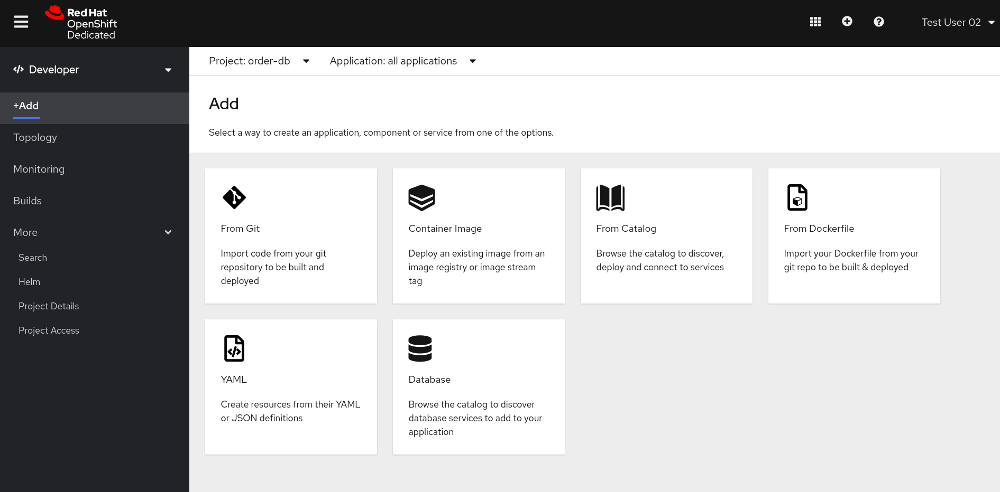

Selecione a opção **PostgreSQL (Ephemeral)**


Clique em **Instantiate Template**


Informe **Conection Username** e **Conection Password** (guarde estas informações pois elas serão necessárias para se conectar ao banco de dados).


Clique em **Topology** e acompanhe o processo de deploy que estará finalizado quando o pod tiver o círculo azul escuro conforme a imagem abaixo:


### Criando a tabela no banco de dados  <a name="testdrive-step-1"></a>

Após finalizar o processo de deploy do banco de dados, volte para a view de **Administrator**.


Selecione a opção **Workloads** e logo abaixo **Pods**. 
Verifique em **Status** se o pod do banco de dados está em **Running** para se certificar que não tivemos nenhum problema até aqui.


Clique no pod do banco de dados na coluna **Name** e logo em seguida selecione a aba **Terminal**.


Utilize o comando abaixo no terminal do seu pod para se conectar ao banco de dados informando o username e a senha do banco de dados.

```bash
psql -h postgresql sampledb username
```
Agora que nos conectamos ao banco de dados iremos criar uma tabela chamada **customer_order** conforme o comando a seguir:

```bash
CREATE TABLE customer_order (id serial PRIMARY KEY, transaction_id VARCHAR(50) NOT NULL, status VARCHAR (50) NOT NULL, system VARCHAR (50) NOT NULL);
```


Agora que a tabela foi criada, iremos verificar qual o endereço de conexão ao banco de dados. Do lado esquerdo clique em **Networking** para expandir e depois clique em **Services**. Na coluna **Location** você verá o IP e a porta para acesso ao banco de dados. Iremos utilizar esta informação mais adiante.


### Criando uma Conexão com um banco de dados no Fuse Online <a name="testdrive-step-2"></a>

Após logar no seu ambiente do Fuse Online, do lado esquerdo clique em **Conections** e logo depois clique em **Create Conection** do lado direito acima.


Todos os conectores do Fuse Online serão listados, selecione a opção **Database**.


Informe a URL de conexão com o banco, bem como o usuário e senha conforme a seguir. Lembre-se que o IP e porta deverão ser os mesmos que aparecem em **Location** quando selecionamos **Networking** e **Services** conforme destacamos 3 passos anteriores. Após preencher os dados clique em **Validate** para verificar se a conexão está correta e depois em **Next**.


Clique em **Save** para salvar a conexão criada. 


### Criando uma API Rest no Fuse Online utilizando API First Approach <a name="testdrive-step-3"></a>

Agora iremos criar a nossa API Rest que possibilitará inserir novas transações no banco de dados **(POST)** ou obter a lista de transações do nosso banco **(GET)**.

No lado esquerdo acima clique em **Integrations** e logo depois em **Create Integration** na parte central:


Logo depois selecione a opção **API Provider**.

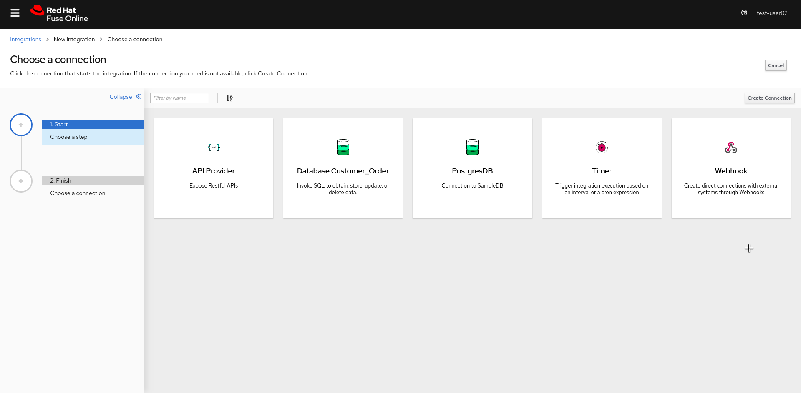

Selecione a opção de **Create a new OpenAPI 2.x document** 


Mude algumas informações da API como **Title, Description**


Logo após cliquem em Add Path do lado esquerdo e defina o **path /customer_order** e clique em **Add**


Depois clique em **Add a data type** do lado esquerdo acima.


Agora preencha os campos **Name, Description** e em seguida no campo **Enter JSON Example** informe o exemplo abaixo.

```json
{
  "transaction_id": "131314",
  "status": "completed",
  "system": "db"
}
```

**O JSON acima contem os que serão enviados pelos clientes de nossa API.**


Obs: Não esqueça de salvar as suas alterações ao final.

Clique novamente no path que foi definido anteriormente **customer_order** para que possamos adicionar operações. Na parte central, selecione **POST** e clique em **Add Operation**

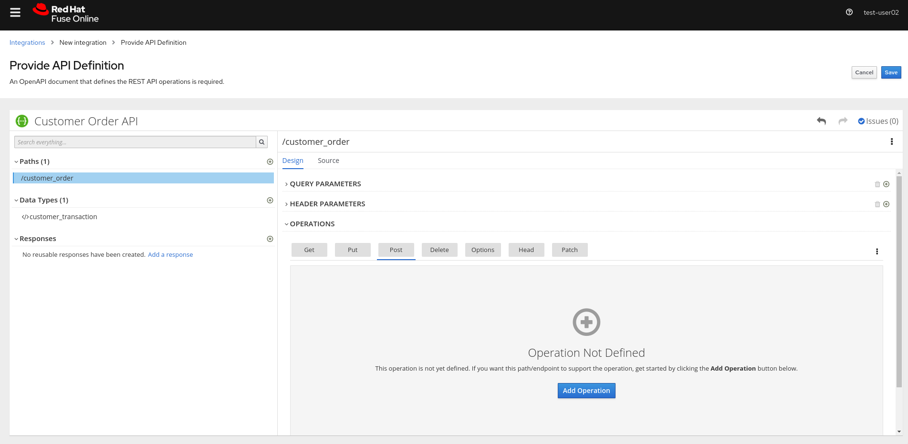

Preencha as informação de **Summary, Description e Operation Id**.

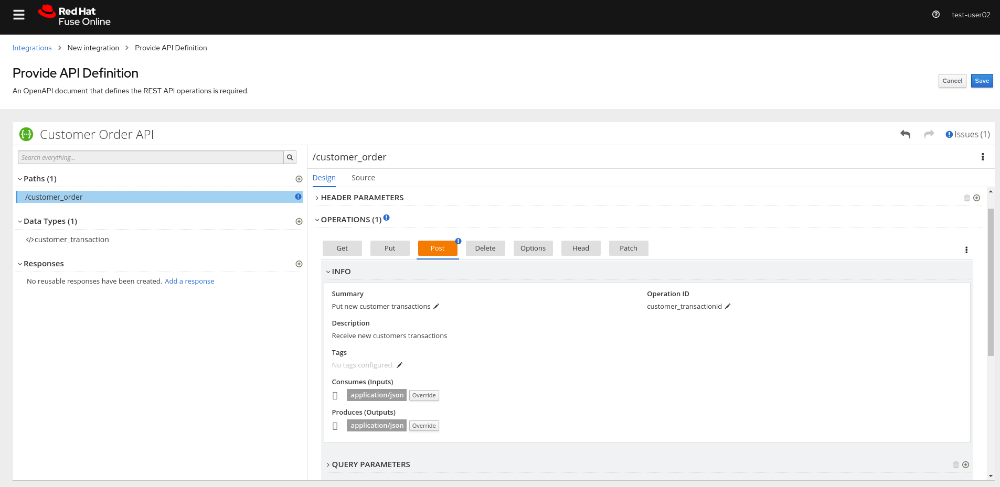

Mais abaixo ainda na operação **POST** clique em **Add a request body** e especifique o Data Type que definimos anteriormente, no nosso caso **customer_transaction**. Este serão os dados recebidos pela API. 

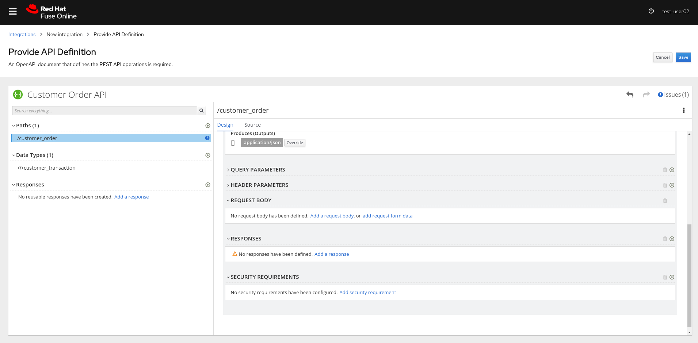

Logo em seguida defina o **Response Type** como o retorno **201 - Created** e logo após selecione **customer_transaction** e também preencha uma **Description** para o retorno da consulta.

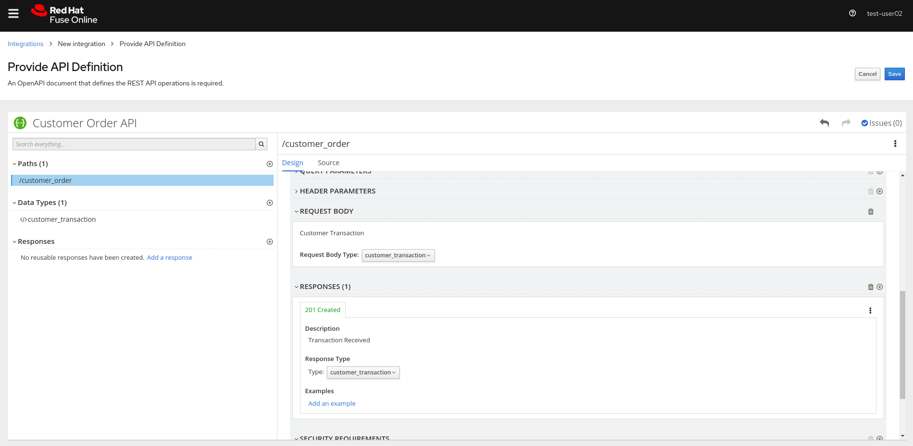

Agora iremos definir a operação **GET** que possibilitará a consulta de todos as transações gravadas no banco de dados.


Preencha as informações do **Summary, Description e Operation ID**

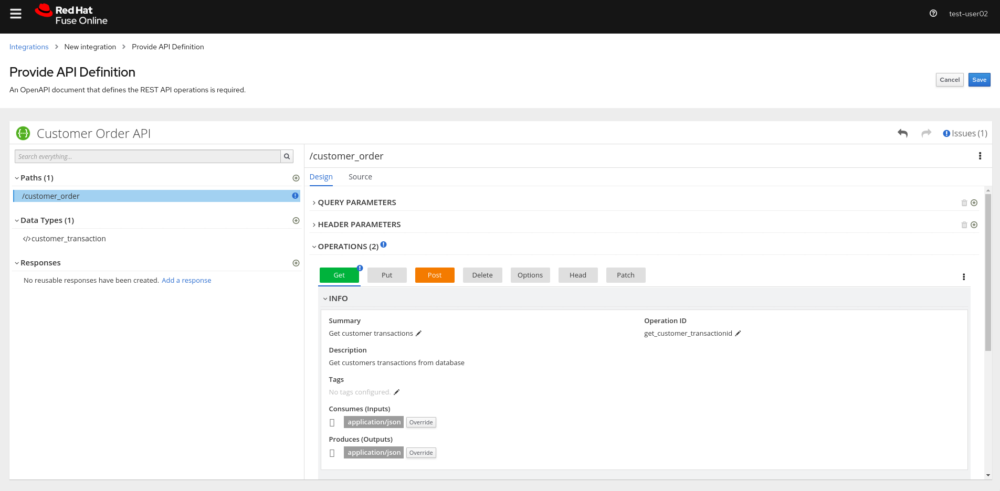

A seguir em **Responses** selecione a opção **200 OK** definindo como **Type** array of customer_transaction (a nossa API retornará um array com todas as transações gravadas no banco). Clique em **Save**.

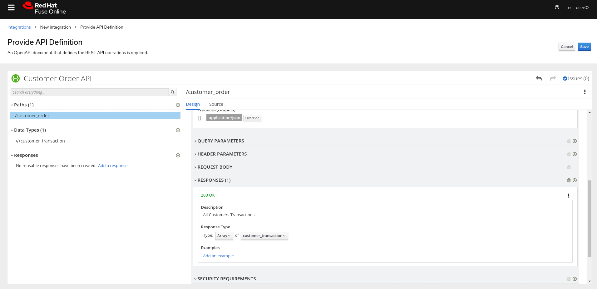

Verifique se não tem nenhum erro em sua API e clique em **Next**.


Veja que agora temos uma API com duas operações definidas **POST / GET** -- Na operação **GET** clique em **Create Flow**


Clique no sinal de **+** no centro da tela para adicionar mais um passo a nossa API que será a conexão com o banco de dados.

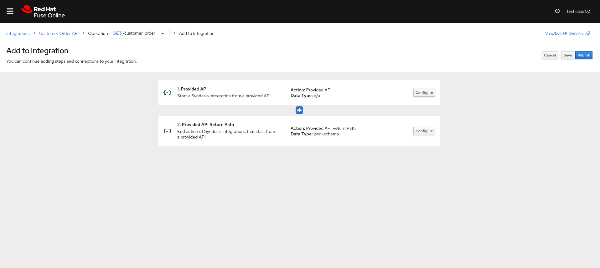

Selecione a conexão com o banco de dados que criamos anteriormente, no nosso caso será a opção **Database Customer_Order** 


Logo em seguida seleciona e opção **Invoke SQL**

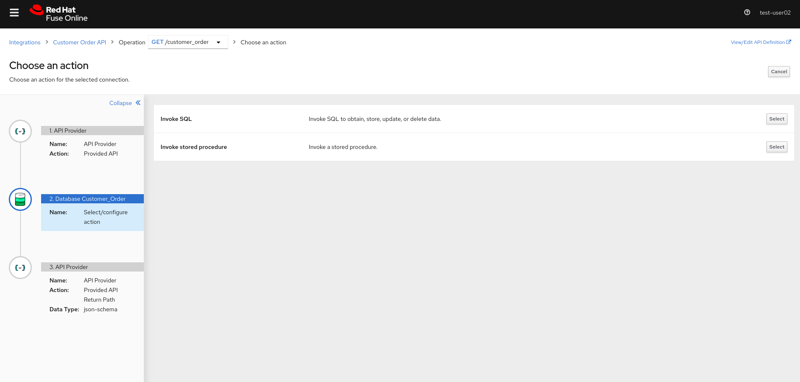

Especifique **SELECT * FROM customer_order** e clique em **Next**. Esta operação **GET** irá trazer os registros de transações do banco de dados. 


Agora precisaremos mapear os campos recebidos em nossa API de acordo com o retorno da query do banco. Clique no ponto de exclamação e em seguida em **Add a data mapping step**

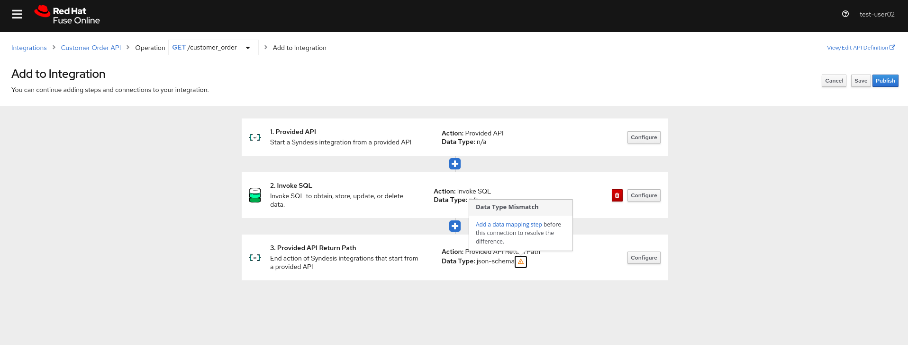

Em seguida realize o mapeamento dos campos conforme a imagem abaixo em seguida clique em **Done**.

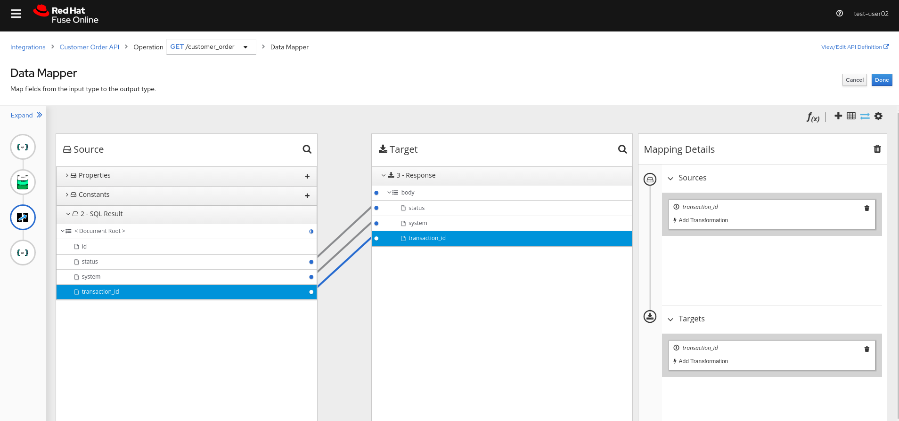

Agora no canto esquerdo acima iremos selecionar a operação **POST**

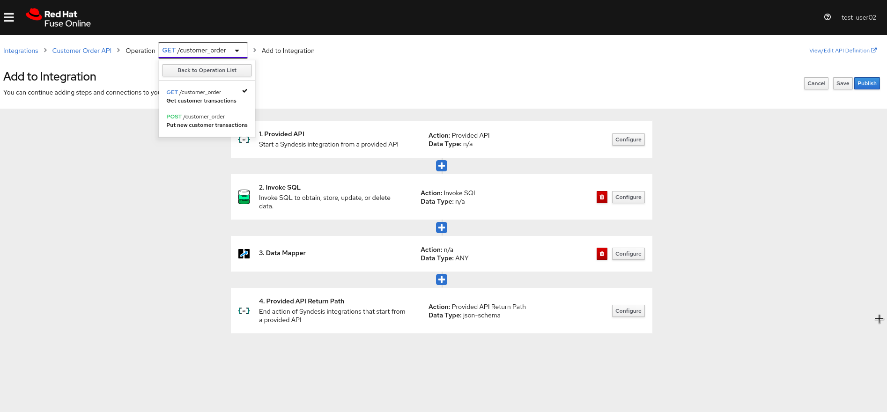

Clique no sinal de **+** para que possamos adicionar uma conexão ao banco de dados.


Selecione novamente a opção **Database Customer_Order**


Clique em **Invoke SQL** 


Especique a query **INSERT INTO CUSTOMER_ORDER (transaction_id, status, system) values (:#transaction_id, :#status, :#system)** e clique em **Next**
Veja que os campos que serão preenchidos pelos valores recebidos na API se inicial com **:#**

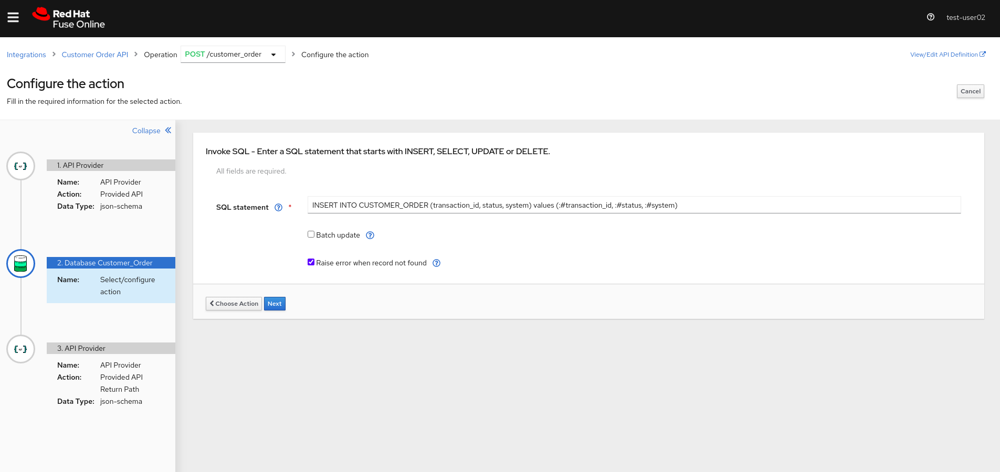

Agora clique em **Add a data mapping step**


Em seguida realize o mapeamento dos campos conforme imagem a seguir e clique em **Done**

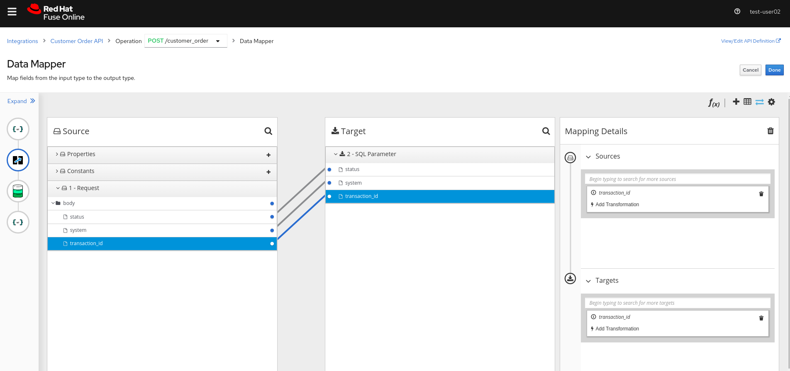

Clique novamente em **Add a data mapping step** no passo final, que será a resposta da nossa query sql

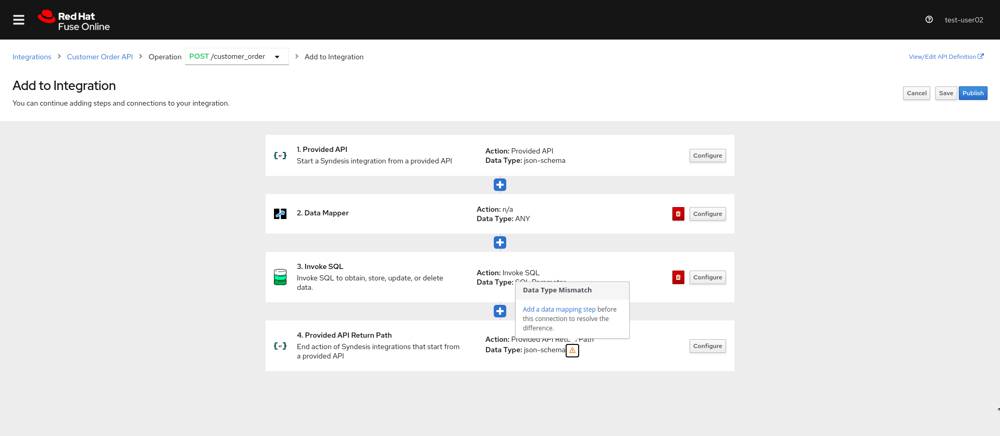

Faça o mapeamento dos campos conforme a seguir e clique em **Done**


Clique em **Save** para salvar as alterações


Defina um nome para sua API e clique em **Save and Publish**


Agora acompanhe a publicação de sua API


Ao final da publicação cliquem em **Disable Discovery** para que possamos copiar a URL de acesso a nossa API e aguarde a publicação ocorrer novamente


Após copiar a URL de acesso a sua API, com uma ferramenta de testes ou usando comandos como o **curl** faça um teste chamando a API. **Não se esqueça de informar o path no final da url, no nosso caso é /customer_order**

**GET**


**POST**
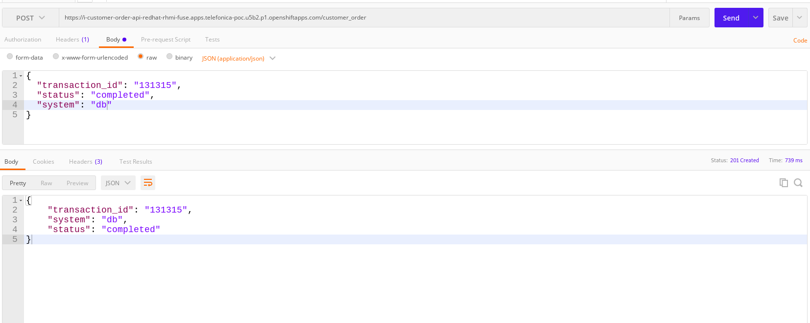

Selecione sua API no Fuse Online e verifique em **Metrics** o total de mensagens recebidas


Clique na aba **Activity** para mais detalhes


